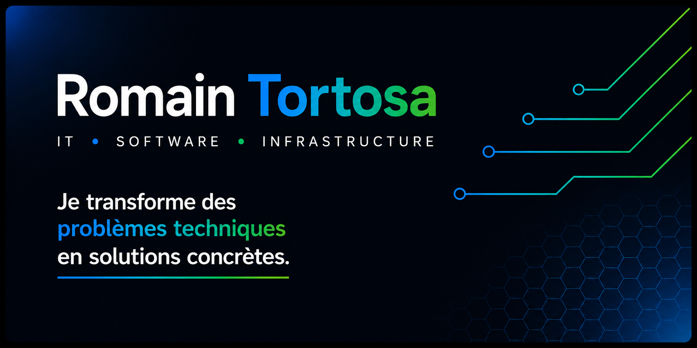

<div align="center">



<br>

[](https://romaintortosa.fr)
[](mailto:rt@romaintortosa.fr)
[](#)

</div>

<br>

## 👋 À propos

Je suis **Romain Tortosa**, passionné par le développement, les infrastructures et la création de solutions techniques.

Je développe principalement des applications et des outils autour de :

- 💻 **Software & applications web**
- 🖥️ **Infrastructure & systèmes**
- 🐳 **Docker & self-hosting**
- 🌐 **Réseaux**
- 📊 **Monitoring**
- ⚙️ **Automatisation**
- 🔧 **Outils métier**

> Je préfère comprendre un problème avant de choisir la technologie qui permettra de le résoudre.

<br>

---

## 🚀 Projets

<table>
<tr>

<td width="50%" valign="top">

### 📦 StockFlow

Application web **auto-hébergée** de gestion de stock et d'inventaire.

Elle permet de savoir :

**quoi · combien · où · quand · qui**

Gestion des objets, emplacements, mouvements, historique et inventaires.

<br>

`Inventory` `Self-hosted` `Web App`

</td>

<td width="50%" valign="top">

### 🖨️ RT-Print3D Manager

Poste de pilotage pour une activité d'impression 3D.

Gestion des imprimantes, filaments, profils, coûts réels, historique de production et rentabilité.

<br>

`3D Printing` `Management` `Monitoring`

</td>

</tr>

<tr>

<td width="50%" valign="top">

### 📊 RT-Monitor

Solution de supervision pour infrastructures et services.

Centralisation des métriques serveurs, containers et applications.

<br>

`Prometheus` `Grafana` `Docker`

</td>

<td width="50%" valign="top">

### 🛠️ RT-InfoService

Solutions informatiques destinées aux particuliers et professionnels.

Dépannage, installation, maintenance, réseau et accompagnement technique.

<br>

`IT` `Infrastructure` `Support`

</td>

</tr>
</table>

<br>

---

## ⚙️ Stack technique

<div align="center">

### Development


<br><br>

### Infrastructure


<br><br>

### Monitoring & Automation


<br><br>


</div>

<br>

---

## 🏠 Infrastructure & Self-hosting

```text
                         INTERNET
                            │
                            ▼
                       ┌─────────┐
                       │ ROUTEUR │
                       └────┬────┘
                            │
                            ▼
                       ┌─────────┐
                       │ SWITCH  │
                       └────┬────┘
                            │
              ┌─────────────┼─────────────┐
              │             │             │
              ▼             ▼             ▼
         ┌────────┐    ┌────────┐    ┌────────┐
         │ DOCKER │    │ LINUX  │    │   PI   │
         └───┬────┘    └───┬────┘    └───┬────┘
             │             │             │
             ▼             ▼             ▼
          SERVICES      MONITORING     AUTOMATION

```
<br>


</div>
